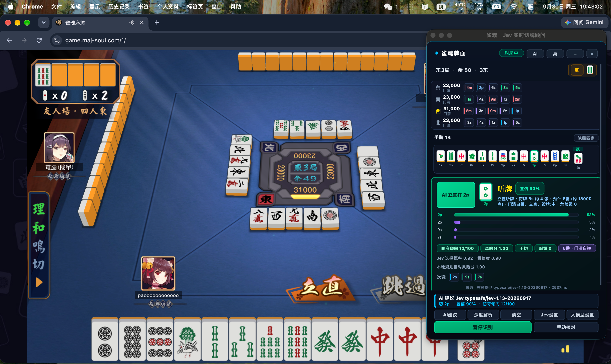
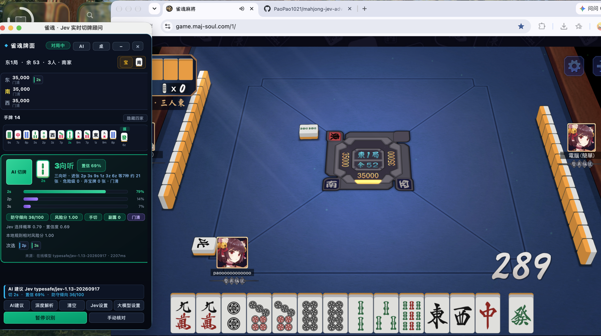

<div align="center">

# 雀魂 · Jev 实时决策顾问

**在牌桌旁查看切牌建议、进张分析与攻守思路。**

面向雀魂网页版的 Python / PySide6 桌面顾问，支持四人麻将与三人麻将。

[](https://github.com/PaoPao1021/mahjong-jev-advisor/actions/workflows/ci.yml)
[](https://www.python.org/downloads/)
[](LICENSE)

[快速开始](#快速开始) · [使用指南](#使用指南) · [常见问题](#常见问题) · [参与贡献](#参与贡献)

</div>

顾问通过只读浏览器扩展获取自己的手牌与牌桌公开信息，先由本地规则生成候选动作，再交给在线模型选择。界面展示推荐动作、向听数、有效牌、风险提示及备选方案；你仍需在游戏中自行操作。

## 演示

### 四人麻将

四家牌河、手牌与立直建议集中展示，便于对照当前牌桌查看。



### 三人麻将

识别三人局，显示三位玩家的公开状态，并按三麻规则生成建议。



*以上为用户提供的运行截图。截图中的模型版本、概率、点数和耗时对应当时局面，界面可能与当前版本略有差异。*

## 目录

- [功能与支持范围](#功能与支持范围)
- [快速开始](#快速开始)
- [使用指南](#使用指南)
- [模型配置](#模型配置)
- [常见问题](#常见问题)
- [配置与数据](#配置与数据)
- [更新方式](#更新方式)
- [开发与测试](#开发与测试)
- [项目结构](#项目结构)
- [已知限制](#已知限制)
- [参与贡献](#参与贡献)
- [致谢与许可证](#致谢与许可证)

## 功能与支持范围

| 功能 | 当前支持 |
| --- | --- |
| 四人麻将 | 切牌、立直、吃碰杠、和牌等候选建议 |
| 三人麻将 | 切牌、立直、碰杠、和牌、拔北；不提供吃牌 |
| 牌理分析 | 向听数、有效进张、可见牌计数、宝牌损失、役种方向与相对危险级 |
| 在线决策 | Vercel Jev、TypeSafe、OpenRouter Jev 与 OpenAI 兼容聊天协议 |
| 深度解析 | 通过单独配置的聊天模型，解释当前推荐动作与攻守思路 |
| 实时数据 | 浏览器 Hook 自动接收牌局事件，支持状态更新与重连恢复 |
| 备用输入 | 手动录入；四人布局的截图、模板匹配与 OCR 识别 |
| 请求恢复 | 临时网络故障最多重试两次；旧请求结束后继续处理最新局面 |
| 桌面界面 | 手牌高亮、牌河展示、窗口缩放、透明度调整 |

**平台：** Windows 与 macOS 由 GitHub Actions 执行测试；建议使用 Python 3.12。Linux 尚未纳入 CI 或桌面验收。

**使用前准备：** 支持加载解压缩扩展的 Chrome / Edge、雀魂网页版，以及所选在线模型服务的 API Key。模型调用可能产生服务商费用；安装本项目不会附带 Key 或额度。

## 快速开始

推荐流程：**下载项目 → 启动顾问 → 测试模型连接 → 安装浏览器扩展 → 进入牌局。**

### 1. 获取项目

安装 [Python 3.12](https://www.python.org/downloads/) 后，克隆仓库：

```bash
git clone https://github.com/PaoPao1021/mahjong-jev-advisor.git
cd mahjong-jev-advisor
```

没有 Git 时，可在仓库页面选择 **Code → Download ZIP**，解压后打开项目文件夹。请保留完整目录，尤其是 `browser-extension` 和 `src`。

### 2. 启动桌面顾问

#### Windows

安装 Python 时保留 Python Launcher（`py`）。在项目文件夹双击 **`run_windows.cmd`**，或在 PowerShell 中执行：

```powershell
.\run_windows.cmd
```

首次启动脚本使用 `py -3.12` 创建 `.venv` 并安装依赖，请保持网络可用。后续启动会复用该虚拟环境。

#### macOS

在终端进入项目文件夹后执行：

```bash
zsh run_macos.sh
```

脚本优先使用 `python3.12`，否则使用 `python3`，并检查版本至少为 3.12。首次运行会创建虚拟环境并安装依赖。也可使用项目中的 `run_macos.command` 启动入口。

截图识别需要为实际运行程序的终端或 Python 授予系统“屏幕录制”权限；网页 Hook 路径不依赖截图校准。

### 3. 配置并测试在线决策

1. 点击顾问底部 **【Jev设置】**。
2. 选择与 API Key 对应的服务预设，填写 Key，核对请求地址与模型名称。
3. 点击 **【测试连接 · 真实请求】**。
4. 等待显示“连接成功”“HTTP 200”及模型信息，再保存。

测试连接会发出一次真实推断，**无需先打开牌局**。只有 HTTP 成功且答案通过校验才算通过。各渠道的地址和协议见[模型配置](#模型配置)。

> 仅使用切牌建议时，配置【Jev设置】即可；【大模型设置】用于可选的【深度解析】，两者独立。

### 4. 安装只读浏览器扩展

1. 保持桌面顾问运行。
2. 在 Chrome 打开 `chrome://extensions`；Edge 打开 `edge://extensions`。
3. 开启 **开发者模式**，点击 **加载已解压的扩展程序**。
4. 选择项目内的 **`browser-extension` 文件夹**，而不是整个项目目录。
5. **完整刷新已打开的雀魂网页**，使扩展在页面启动时接入连接。
6. 进入牌局，等待顾问出现 **“实时牌局已识别”**，并确认手牌与游戏一致。

也可从顾问 **【桌】→【打开网页 Hook 扩展目录】** 定位文件夹。扩展的匹配域名见 [manifest.json](browser-extension/manifest.json)，包括雀魂的 `maj-soul.com`、`maj-soul.net`、`mahjongsoul.com` 等网页入口。

### 5. 查看第一条建议

当状态已识别、模型已配置后，顾问会随局面变化请求建议。若底部仍显示 **【开始识别】**，点击开启；运行中会显示 **【暂停识别】**。

先确认三件事：

- **手牌一致**：顾问中的手牌、摸牌与雀魂画面对应。
- **玩法正确**：局况栏显示三人或四人，以及自风信息。
- **来源明确**：建议区域显示在线模型及耗时，或明确标注的本地规则结果。

推荐动作由你在游戏内执行。浏览器 Hook 模式下，无需先框选牌桌或标注视觉模板。

## 使用指南

### 日常操作

| 按钮 / 菜单 | 用途 |
| --- | --- |
| 【开始识别】/【暂停识别】 | 开启或暂停自动建议流程 |
| 【AI建议】 | 对已取得的当前局面重新请求建议 |
| 【深度解析】 | 使用聊天模型解释当前选中的建议，需先配置【大模型设置】 |
| 【手动核对】 | 修正或录入手牌、玩法、宝牌指示牌、按钮与局况 |
| 【清空】 | 清除当前展示的状态与建议 |
| 【Jev设置】 | 配置在线决策渠道、Key、模型、超时与本地回退 |
| 【桌】→【查看网页 Hook 诊断】 | 查看扩展版本、帧计数、状态重建次数和解码错误 |
| 【AI】→【载入示范对局状态】 | 查看界面示例；示范状态不能作为真实牌局发送建议请求 |
| 【桌】→【窗口透明度】 | 调整窗口透明度，也支持 Ctrl + 滚轮 |

### 怎样阅读建议

- **向听数**表示距离听牌的进度；“听牌”为 0 向听。
- **有效牌 / 进张**根据当前手牌与已知可见牌估算，不知道对手暗手和未来牌墙。
- **选择概率、置信度**仅在在线服务返回相应数据时展示。选择概率不是和牌率，也不是收益保证；本地规则评分会使用不同标注。
- **危险级、防守倾向**是启发式指标，不是经过校准的放铳概率。
- **役种、番数与点数**属于当前实现的估算。三人局暂不显示四麻计分库计算的点数总额。

### 三人麻将

网页 Hook 根据开局点数列表或重连快照自动识别人数，无需额外切换。三麻处理包括：

- 移除二至八万及赤五万，不把这些牌计入有效进张。
- 不允许吃牌；一万指示九万、九万指示一万。
- 仅在游戏提供拔北操作时加入拔北候选。
- 已拔北计入可见牌及宝牌番数，不计作副露；拔北宝牌不能单独成役。
- 在线决策与深度解析均携带三麻信息。

手动输入时选择 **【手动核对】→【玩法】→【三人麻将（雀魂）】**。三人局实时使用请走网页 Hook；当前截图 OCR 仍按四人布局处理。

### 手动核对与牌码

手动输入不依赖浏览器扩展，可用于检查具体手牌。打开【手动核对】，填写手牌、宝牌指示牌、可见按钮和局况，确认后即可请求建议。

| 记法 | 含义 | 示例 |
| --- | --- | --- |
| `m` | 万子 | `1m` 一万 |
| `p` | 筒子 | `5p` 五筒 |
| `s` | 索子 | `9s` 九索 |
| `z` | 字牌，1–7 为东南西北白发中 | `4z` 北，`7z` 中 |
| `0m` / `0p` / `0s` | 赤五 | 三麻不使用 `0m` |

手牌可输入 `123m456p789s123z55m`，也可逐张用空格分隔。按钮支持“立直”“碰”“过”“拔北”等文字；**只填写游戏当前实际提供的操作**。判断吃碰杠时，还需填写上一张弃牌。

若只想保留手动输入，取消勾选“用本次核对自动学习当前牌面，并恢复实时监测”。高级 JSON 可填写全部玩家数据，例如：

```json
{
  "player_count": 3,
  "hand": "19m123456p123s114z",
  "seat": 0,
  "round_wind": "E",
  "round_number": 1,
  "seat_wind": "E",
  "scores": [35000, 35000, 35000],
  "rivers": [[], [], []],
  "melds": [[], [], []],
  "riichi": [false, false, false],
  "nuki": [0, 0, 0],
  "dora_indicators": ["9p"],
  "buttons": ["nuki"],
  "open_melds": 0
}
```

`seat` 从 0 开始；玩家数组使用实际座位顺序，长度应与人数一致。`nuki` 是各玩家已拔出的北牌数量。示例中的 `nuki` 按钮假定当前游戏允许拔北。

### 截图识别：四人局备用方式

无法使用网页 Hook 时，可以尝试截图识别：

1. 【桌】→【选择牌桌画面】，框选完整牌桌。
2. 【桌】→【基础区域校准】，标记手牌、摸牌和操作按钮区域。
3. 按需使用【扩展区域校准】补充牌河、分数等公开区域。
4. 使用【标注牌面样本】，或通过手动核对学习当前牌面。
5. 点击【开始识别】，对照游戏检查结果。

模板依赖分辨率、缩放和牌面样式；改变布局后可能需要重新校准。项目不附带覆盖所有雀魂样式的视觉模型。识别矛盾或置信度不足时，程序会暂停建议并清除旧推荐。

## 模型配置

### 在线决策：Jev 设置

以下是**程序内置预设**，可按服务商提供的信息修改。账户权限、可用模型及收费以对应服务为准。

| 协议 | 完整 POST 地址 | 预设模型 |
| --- | --- | --- |
| Vercel Jev 评估 | `https://ai-gateway.vercel.sh/v4/ai/evaluation-model` | `typesafe-ai/jev-latest` |
| TypeSafe System One | `https://api.typesafe.ai/v1/systemone` | `jev-latest` |
| OpenRouter Jev System One | `https://openrouter.ai/api/v1/systemone` | `jev-latest` |
| OpenAI 兼容 Chat Completions | `https://ai-gateway.vercel.sh/v1/chat/completions` | 填写该服务支持的聊天模型 ID |

这里需要的是**完整接口地址**。评估协议与 Chat Completions 的请求格式不同，请勿只替换模型名而保留不匹配的协议。聊天模型必须返回候选动作 ID；候选外动作和无效概率会被拒绝。

### 深度解析：大模型设置

填写 API Base URL、API Key 和模型名称。此处使用 OpenAI 兼容聊天协议，程序会在 Base URL 后追加 `/chat/completions`，因此**不要重复填写该后缀**。

配置后，先取得一条有效建议，再点击【深度解析】。解析用于解释所选动作，不会代替你执行游戏操作。

### 超时、重试与本地回退

- 在线决策单次超时默认 **15 秒**，可在设置中调整。
- 在线决策与深度解析遇到超时、连接中断、HTTP 429 或 5xx 时，最多自动重试两次，间隔 0.5 秒和 1 秒；总等待可能超过单次超时。
- 请求期间到达的新局面会被保留，旧请求结束后继续处理最新状态，过期结果不会覆盖新局面。
- **本地回退默认关闭**。开启后，在线决策在可回退的网络或网关故障耗尽重试时显示本地规则建议，并标明来源。
- Key、账单、地址或答案格式错误不会被当作成功，也不会通过上述回退掩盖。未配置 Key 时仍需先完成在线决策配置。

## 常见问题

| 现象 | 检查与处理 |
| --- | --- |
| Windows 提示找不到 Python | 安装 Python 3.12 和 Python Launcher，在终端运行 `py -3.12 --version` 确认 |
| macOS 提示版本不满足 | 检查 `python3.12 --version` 或 `python3 --version`，确保至少为 3.12 |
| 安装依赖失败 | 查看启动终端的错误；在虚拟环境中重新执行 `python -m pip install -e .`，确认网络可访问依赖源 |
| 扩展已连接，但没有手牌 | “已连接”只证明桥接可达。刷新雀魂网页并进入牌局，在【桌】→【查看网页 Hook 诊断】检查帧与状态计数 |
| 更新后仍提示扩展过旧 | 在浏览器扩展页面点击“重新加载”，再刷新雀魂页面；仅刷新游戏不会更新扩展脚本 |
| 本机端口 8765 被占用 | 检查是否重复启动顾问，关闭多余实例后重启 |
| HTTP 401 / 403 | 检查 Key 是否属于所选服务；`customer_verification_required` 表示需按服务商要求完成账户验证 |
| HTTP 402 | 检查服务商余额与额度 |
| HTTP 404、非 JSON 或答案无法使用 | 检查完整地址、协议与模型是否匹配；HTTP 200 本身不等于有效建议 |
| HTTP 429 / 5xx、偶发超时 | 等待有限次数自动重试，必要时调整超时；仍失败可点击【AI建议】重试，并查看服务商状态 |
| 显示“当前没有可建议的操作” | 可能尚未轮到你操作；先核对手牌数量与可见按钮 |
| 手动三人局报错 | 检查是否含二至八万、北家、吃牌按钮或四个玩家的数据 |
| 截图显示“待校准”或牌面错误 | 完成区域校准和模板标注，检查缩放与牌面样式；macOS 同时检查屏幕录制权限 |
| 深度解析不可用 | 先配置【大模型设置】，并确认已有当前局面的有效建议 |

### 本机自检

Windows 双击 `check_windows.cmd`，或执行：

```powershell
.\run_windows.cmd --check
```

macOS：

```bash
zsh run_macos.sh --check
```

自检包含依赖、OCR、校准、模板与采集状态。**`ready: false` 可能来自尚未配置的截图备用路径，不等于网页 Hook 不可用。**

如需额外检查真实在线连接，在已安装依赖的虚拟环境中运行：

```bash
python -m mahjong_jev_advisor.preflight --online --output readiness-report.json
```

`--online` 会发出真实模型请求并可能产生费用；不加该参数时执行本机检查。

## 配置与数据

配置不存放在项目目录中：

| 系统 | 默认目录 |
| --- | --- |
| Windows | `%APPDATA%\mahjong-jev-advisor\` |
| macOS | `~/Library/Application Support/mahjong-jev-advisor/` |
| 其他系统 | `${XDG_CONFIG_HOME:-~/.config}/mahjong-jev-advisor/` |

目录中可能包含 `settings.json`、牌面模板 `templates/`，以及启用决策日志后生成的 `decisions.jsonl`。损坏配置重新保存时会备份为 `settings.invalid.json`。可用 `MAHJONG_ADVISOR_CONFIG_DIR` 指向独立目录进行开发或测试。

数据流与凭据处理：

- 扩展将截获的雀魂二进制帧转发到本机 `127.0.0.1:8765`；桌面端在内存中解码，不保存原始帧，不发送游戏操作。
- 在线决策会向你配置的服务发送**自己的手牌、公开局况及候选动作**；深度解析会发送对应局况与推荐内容。本项目并非完全离线工具。
- API Key 以明文保存在本机配置中；请勿提交或分享该文件。决策日志也可能包含手牌与局况。
- 决策日志默认关闭。截图只有在相应保存操作中写出；模板学习会保存牌面小图。
- 官方渠道可通过 `AI_GATEWAY_API_KEY`、`TYPESAFE_API_KEY`、`OPENROUTER_API_KEY` 补充对应 Key。自定义地址不会自动获取这些渠道环境变量，界面中保存的 Key 优先。

## 更新方式

使用 Git 安装时，先关闭顾问，在项目目录执行：

```bash
git pull --ff-only
```

再使用原启动脚本启动。若更新包含依赖变更，在项目虚拟环境中重新安装：

```powershell
# Windows
.venv\Scripts\python.exe -m pip install -e .
```

```bash
# macOS
.venv/bin/python -m pip install -e .
```

若扩展文件有更新，还需在浏览器扩展页面**重新加载扩展，再刷新游戏**。通过 ZIP 安装时下载新的完整源码目录，并确认浏览器加载的是新目录内的扩展。本机配置保存在用户目录中，不随替换源码自动删除。

## 开发与测试

### 建立开发环境

在项目根目录创建虚拟环境；已有 `.venv` 时直接使用即可。

```powershell
# Windows PowerShell
py -3.12 -m venv .venv
.venv\Scripts\python.exe -m pip install -e ".[dev]"
.venv\Scripts\python.exe -m pytest -q
.venv\Scripts\python.exe -m mahjong_jev_advisor.replay --states tests/fixtures/states.jsonl
```

```bash
# macOS
python3.12 -m venv .venv
.venv/bin/python -m pip install -e '.[dev]'
.venv/bin/python -m pytest -q
.venv/bin/python -m mahjong_jev_advisor.replay --states tests/fixtures/states.jsonl
```

测试覆盖状态校验、四麻与三麻规则、Hook 解码及恢复、协议解析、真实本机 HTTP 往返、临时失败重试、Qt 后台任务与界面更新。测试使用隔离配置目录，避免修改真实用户设置。

CI 在 Windows 和 macOS 上安装项目、运行 pytest 和 JSONL 回放，最新结果见 [Actions](https://github.com/PaoPao1021/mahjong-jev-advisor/actions/workflows/ci.yml)。本机 HTTP 测试不依赖付费模型账户，也不能证明外部服务当前可用；状态回放耗时不包含屏幕识别或远程模型耗时。

### 数据处理流程

```text
雀魂网页版 → 只读浏览器扩展 → 本机 Hook 桥接 ─┐
截图 → 区域校准 / 模板 / OCR ────────────────┼→ GameState 校验
手动录入 ──────────────────────────────────┘       ↓
                                            本地候选生成
                                                  ↓
                                         在线模型选择 → 桌面建议
                                                  ↓
                                         可选聊天模型深度解析
```

## 项目结构

```text
mahjong-jev-advisor/
├── browser-extension/          # 页面 Hook、扩展桥接和 Manifest V3 配置
├── src/mahjong_jev_advisor/
│   ├── app.py                  # 桌面入口、后台任务与建议调度
│   ├── hook.py                 # 本机 HTTP 桥接、Liqi 解码与牌局重建
│   ├── liqi.json               # 随项目提供的协议结构
│   ├── state.py                # GameState、Candidate、Advice 与状态校验
│   ├── rules.py                # 候选动作、向听、进张与风险启发式
│   ├── yaku.py                 # 役种方向与听牌价值估算
│   ├── jev.py                  # 在线决策协议、结果校验与重试
│   ├── llm.py                  # 聊天模型深度解析
│   ├── vision.py               # 截图、OCR、模板识别与学习
│   ├── ui_*.py                 # 牌面绘制、界面组件与设置对话框
│   ├── settings.py             # 用户配置与可选决策日志
│   ├── preflight.py            # 本机及在线自检
│   └── replay.py               # 状态 / 图像回放入口
├── tests/                      # 单元测试、集成测试与回放样本
├── docs/images/                # README 演示截图
├── .github/workflows/ci.yml     # Windows / macOS CI
├── pyproject.toml              # 包配置、依赖与命令入口
├── run_windows.cmd             # Windows 启动脚本
├── run_macos.sh                # macOS 启动脚本
└── LICENSE                     # MIT 许可证
```

## 已知限制

- **建议仍需核对。** 副露目前使用平铺牌列表，暗杠、加杠、吃后禁打、立直后操作等复杂情形尚未完成完整牌谱验收，不能保证所有候选在所有局面下均合法。
- **三麻计分不完整。** 已处理三麻牌池、拔北与宝牌差异；不同房间的计分规则未完整建模，暂不提供三麻点数总额。
- **部分 HUD 数值为估算。** 余牌显示、相对风险和番数不是游戏服务端的结算结果，应以游戏实际状态为准。
- **视觉路径需要适配。** 截图识别依赖校准和模板；三人布局、跨屏混合 DPI 与完整录屏准确率尚未完成验收。
- **服务与协议会变化。** 雀魂协议或界面调整可能影响 Hook；在线模型时延取决于网络、渠道和模型，未承诺固定响应时间。

## 参与贡献

欢迎通过 [Issues](https://github.com/PaoPao1021/mahjong-jev-advisor/issues) 报告问题或讨论功能，通过 Pull Request 提交改进。

报告问题时请提供：系统与 Python 版本、当前提交、三人或四人玩法、Hook 或截图输入方式、复现步骤、预期与实际结果，以及脱敏后的错误信息。Hook 问题可附诊断面板；牌理问题可附最小状态 JSON。不要提交 API Key、完整用户配置或带凭据的原始网络数据。

提交改动前，请运行 pytest 和回放命令。行为修复应附可复现的回归用例；协议或状态结构变更应兼顾四麻、三麻和重连恢复。适合参与的方向包括复杂副露建模、三麻计分、视觉识别适配与测试样本补充。

## 致谢与许可证

本项目使用 PySide6 构建桌面界面，依赖 [MahjongRepository/mahjong](https://github.com/MahjongRepository/mahjong) 进行向听与和牌价值计算，并使用 OpenCV、RapidOCR、MSS 等组件处理视觉输入。各依赖遵循其各自许可证。

项目代码采用 [MIT License](LICENSE)。演示中的雀魂游戏画面及相关素材权利归原权利人所有；本项目不是雀魂官方产品。
